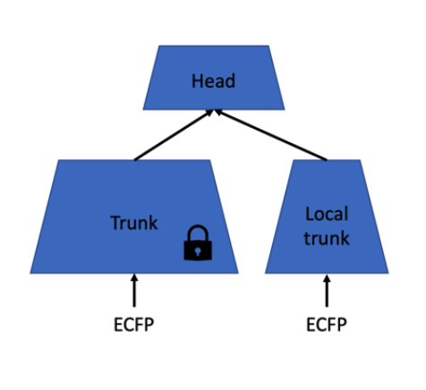

# Introduction

This package provide **fast** and **accurate** machine learning models for biochemical applications.
Especially, we support very high-dimensional models with sparse inputs, *e.g.*, millions of features and millions of compounds.
The general documentation can be found in this [folder](docs/).

# Local trunk branch

In this branch an extra script is created: [retrain.py](examples/chembl/retrain.py). The objective for this script is to start with a given pretrained (federated) sparsechem model and integrate and fix the trunk of this model inside a new model. This new model will provide an extra local trunk and on top a new head. The local trunk and new head will be trained using local data while the given pretrained trunk will not be altered.



# How to use retrain script

The same parameters as the [train script](example/chembl/train.py) should be provided. These parameters are explained in detail [here](docs/main.md). Two extra parameters should be provided:

```
  --conf CONF           Model conf file (.json or .npy)
  --model MODEL         Pytorch model file (.pt)
```

The output of this script is similar as the regular [train script](example/chembl/train.py).

# Fold setup

In the federated run these folds were used:

```
FOLD_TEST=0
FOLD_VALIDATION=1
```

after hyperparameter tuning, the federated model was trained in phase 2 also including the `FOLD_VALIDATION=1` only leaving out `FOLD_TEST=0`. So for local retraining using local trunk the suggestion is to split up this `FOLD_TEST=0 `in `FOLD_LOCAL_VAL=0.1` and `FOLD_LOCAL_TEST=0.2`. However the way how to do it is not defined yet and still under discussion. So for the first 'sanity tests' the only fold available to evaluate the trained model (including HP tuning which is a problem for overfitting) is `FOLD=0`.

# Example run

For running the retrain script this example could be used:

```
python retrain.py \
  --x ./chembl_23_x.npy \
  --y ./chembl_23_y.npy \
  --folding ./folding_hier_0.6.npy \
  --fold_va 0 \
  --batch_ratio    0.02 \
  --hidden_sizes   400 \
  --last_dropout   0.2 \
  --middle_dropout 0.2 \
  --weight_decay   0.0 \
  --epochs         20 \
  --lr             1e-3 \
  --lr_steps       10 \
  --lr_alpha       0.3
  --conf hyperparameters.json
  --model federated_model.pt
```

The conf file is only used to be able to read out correctly the federated model. It is not taken into account for the hyperparameters. The hyperparameters for training of the local trunk (and new head) should be set using the cli.

# Example predict step

In order to evaluate the newly trained model, a separate predict script is also provided: [predict_local_trunk.py](examples/chembl/predict_local_trunk.py). Together with the newly trained model now two config files need to be provided:
1. The config file from the federated model. (--fedconf)
2. The config file saved together with the newly trained model. (--conf)

Example:
```
python predict_local_trunk.py --x chembl_23mini_x.npy --y chembl_23mini_y.npy \
--folding chembl_23mini_folds.npy --fedconf models/hyperparameters.json \
--conf models/sc_run_h700.700_ldo0.2_wd0.0_lr0.001_lrsteps10_ep20_fva0_fteNone.json \
--model models/sc_run_h700.700_ldo0.2_wd0.0_lr0.001_lrsteps10_ep20_fva0_fteNone.pt \
--predict_fold 0 --dev cpu --outprefix testing
```
